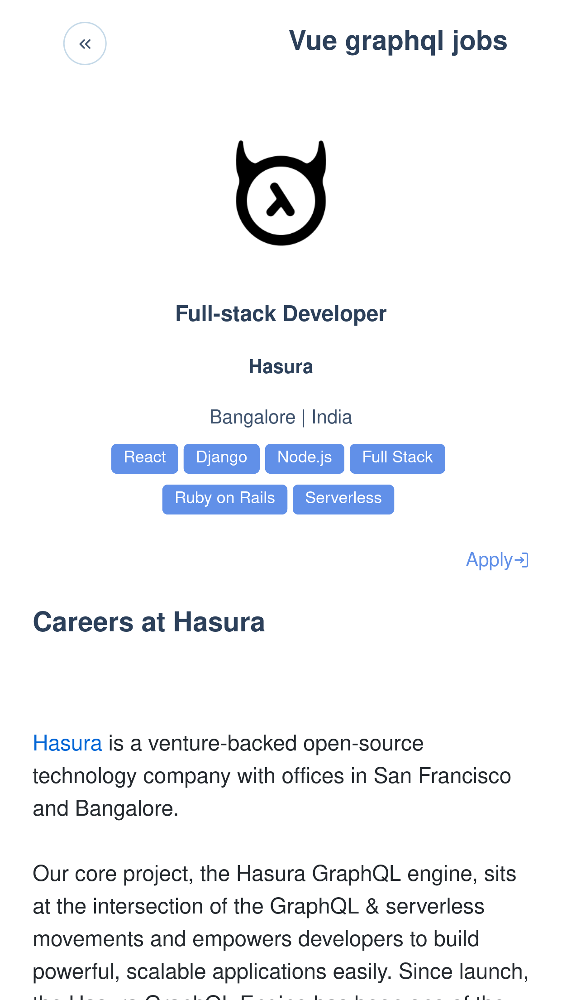
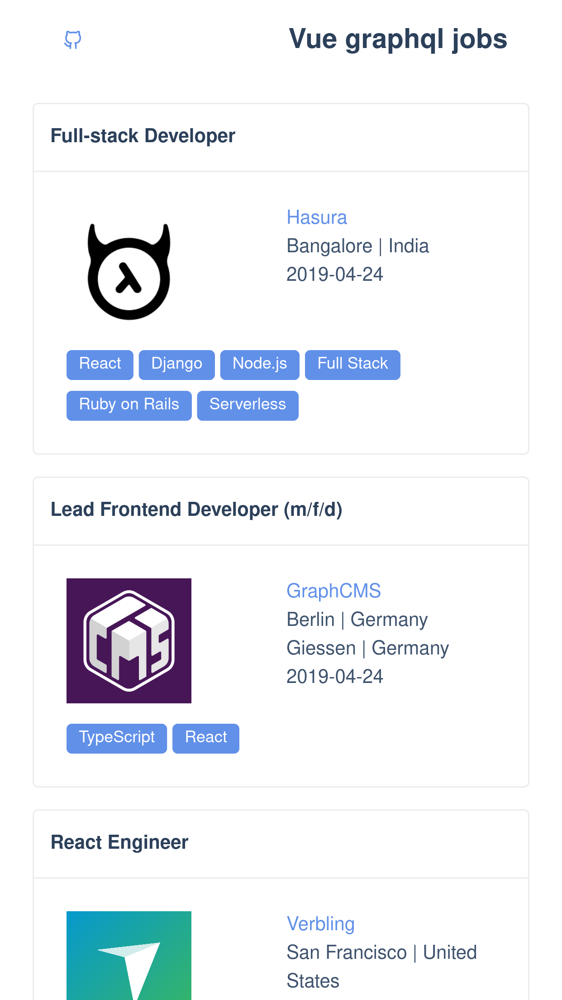

Jobs app with easy browse through the graphql related programming jobs. Job offers come from [graphql jobs api](https://graphql.jobs/).

### Screenshots

Job

Jobs list

## Build with

 * [Vue.js](https://vuejs.org/)
 * [Vue Apollo](https://apollo.vuejs.org/)
 * [AT-UI](https://at-ui.github.io/at-ui/#/en)