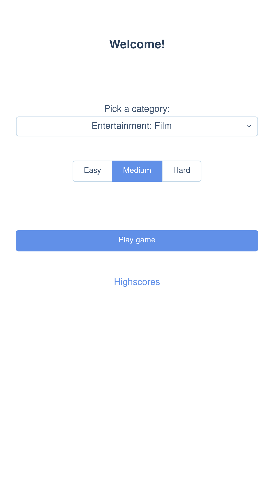
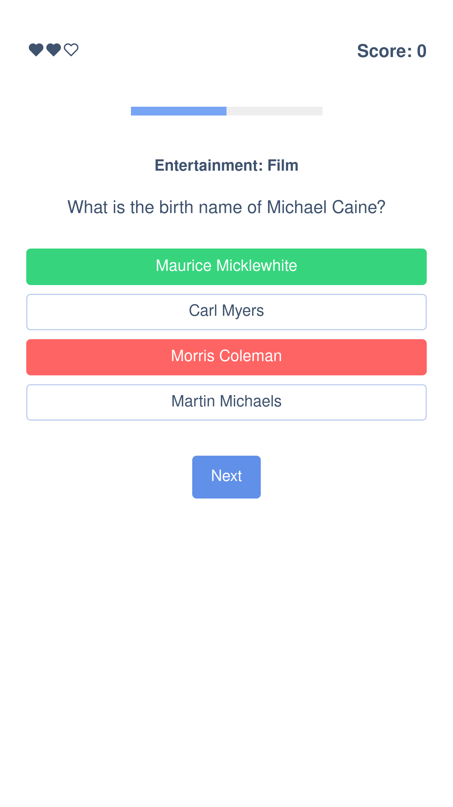
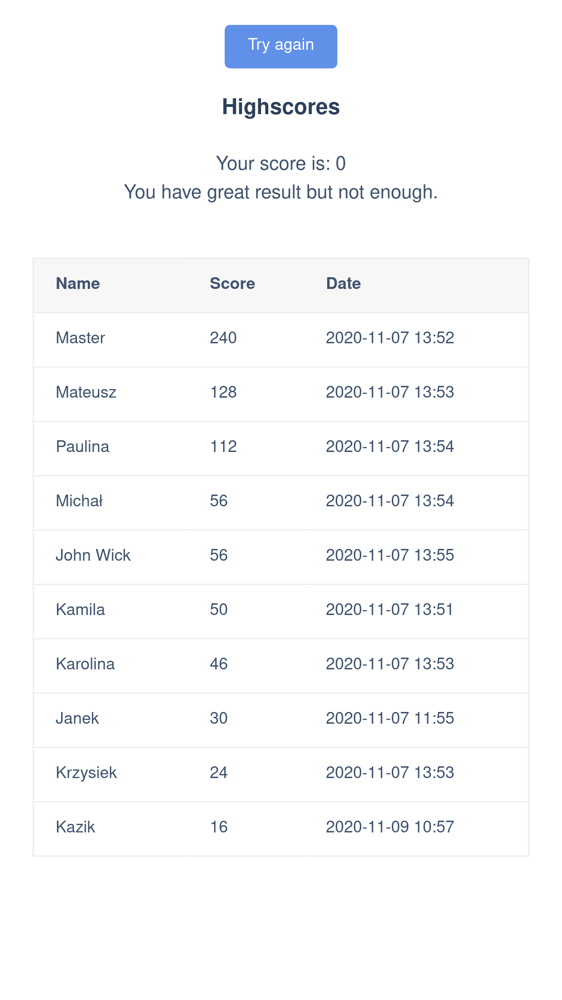

Trivia game powered by Open Trivia DB connected with firebase.

## Features:

* 23 question categories

* Firebase connection for store highscores table

* Over 3,200 questions from [Open Trivia DB](https://opentdb.com/).

### Screenshots

Quiz start 

Quiz game 

Quiz endgame 

## Build with

 * [Vue.js](https://vuejs.org/)
 * [Open Trivia DB](https://opentdb.com/)
 * [AT-UI](https://at-ui.github.io/at-ui/#/en)