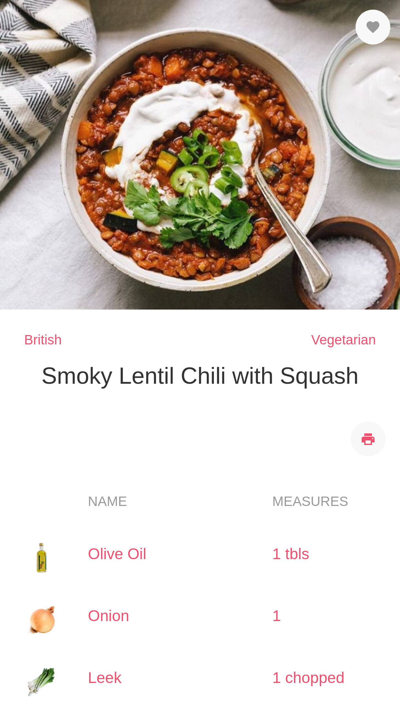
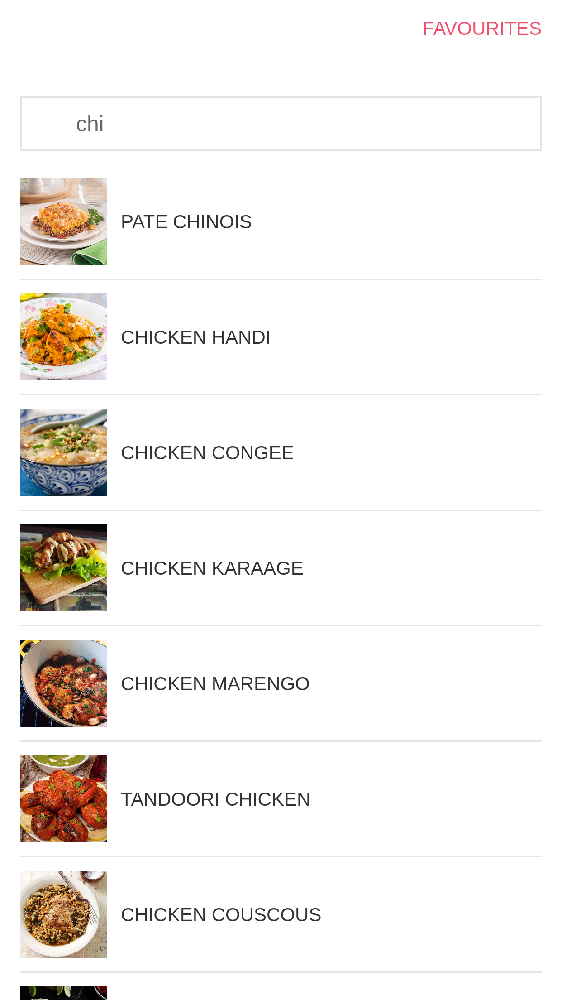
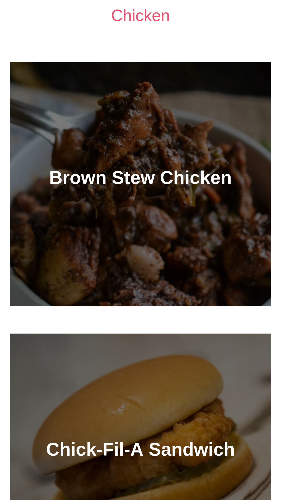

## APP IN PROGRESS

Explore recipes comes from [themealdb](https://www.themealdb.com/) by categories, country or just got the random one. Easy instructions and shopping list with export feature.

### Screenshots

Recipe 

Recipes list 

Recipes preview  

## Build with

 * [Vue 3](https://vuejs.org/)
 * [UI KIT](https://getuikit.com/)